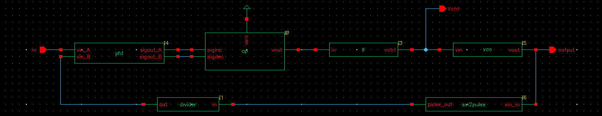
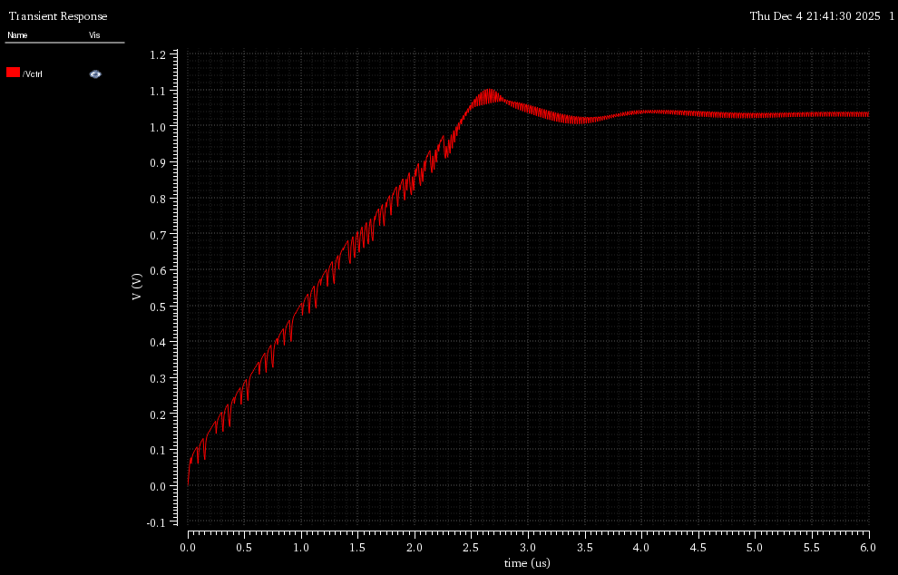
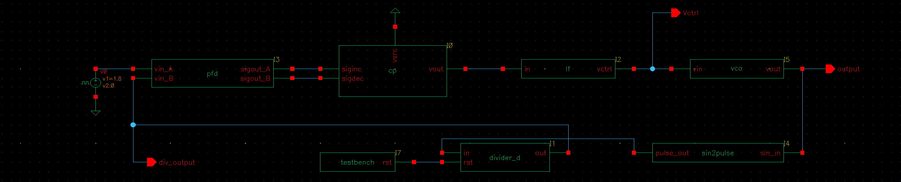
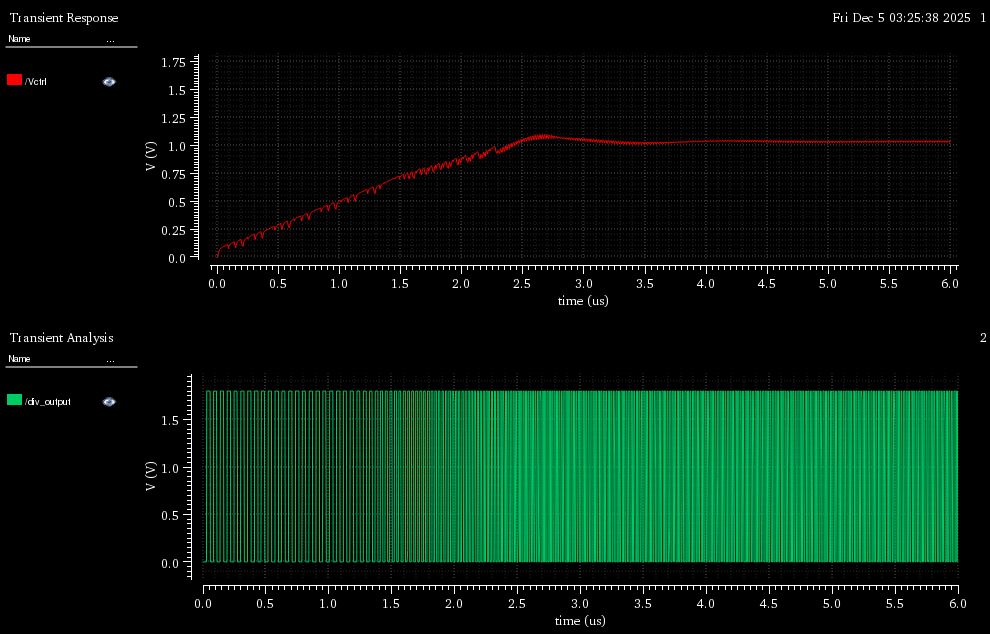
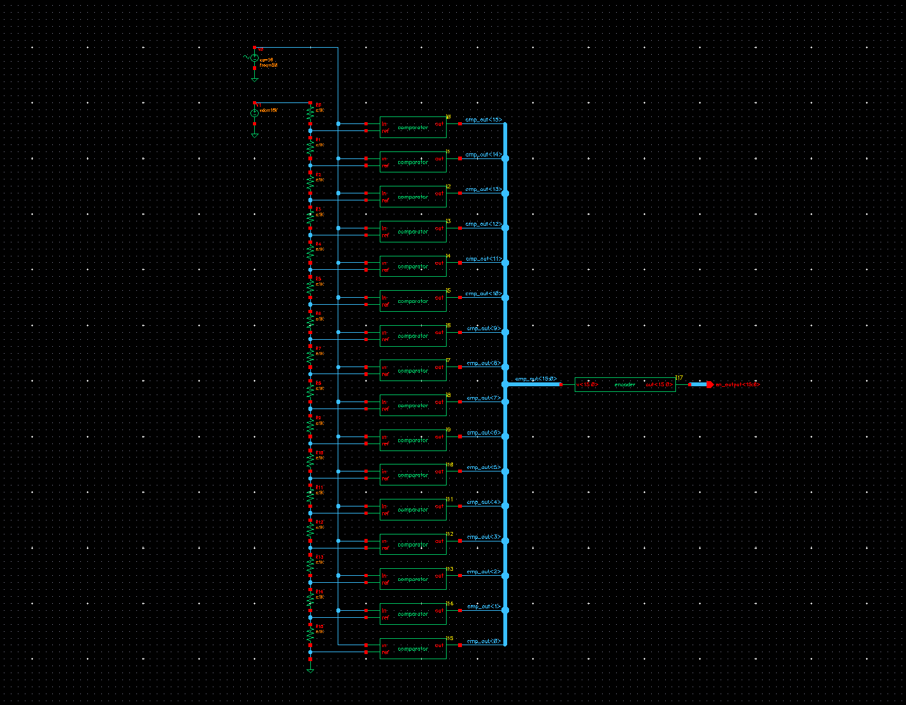
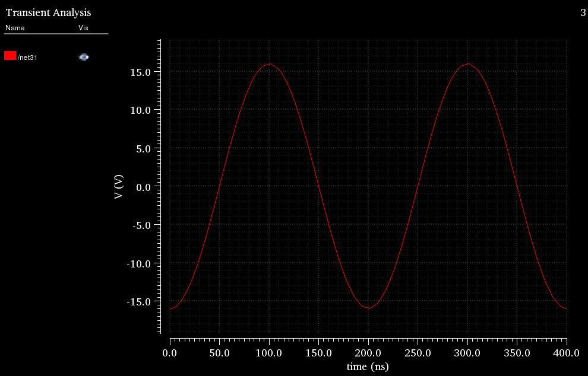
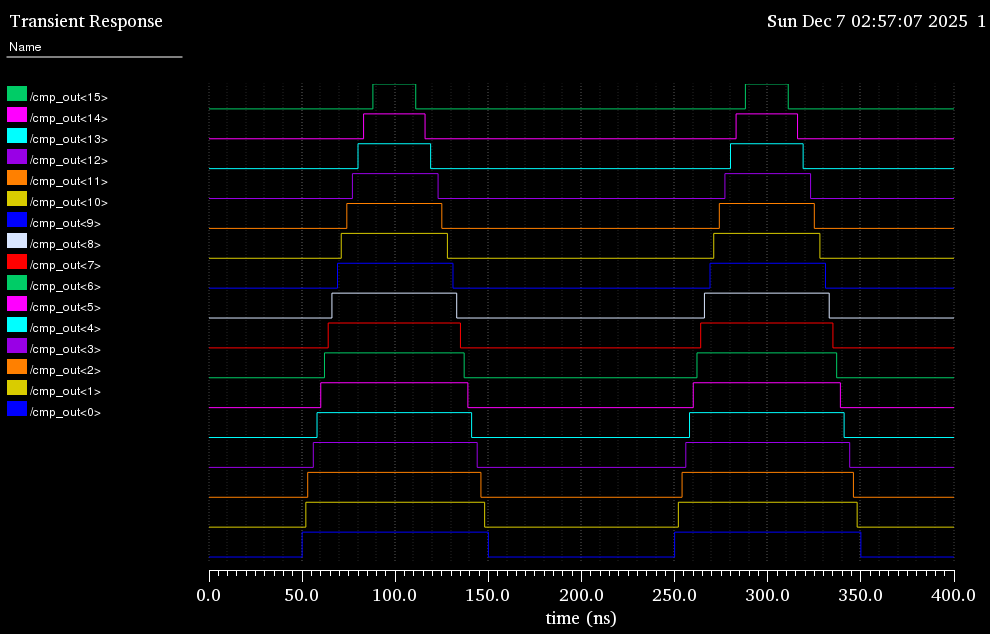
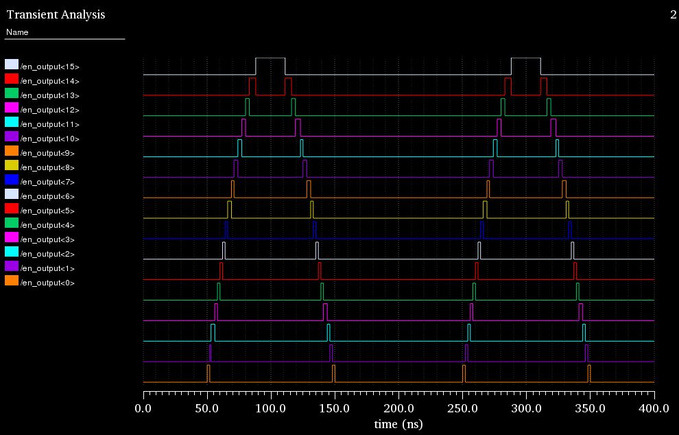

# Mixed-Signal System Modeling and AMS Simulation
The AMS Designer Framework is a comprehensive mixed-signal simulation environment that integrates the Spectre analog simulator with the NC-Sim digital engine. This system facilitates a top-down design methodology, allowing for the verification of complex System-on-Chip (SoC) designs using behavioral modeling languages such as Verilog-A, Verilog, and Verilog-AMS. The implementation covers three primary labs: (1) transitioning from pure analog PLL modeling to (2) mixed-signal behavior verification, and (3) implementing a complex 16-to-16 one-hot ADC.

## Problem Formulation
The goal is to design and verify mixed-signal systems through three progressive stages: (1) PLL analog simulation using Verilog-A models , (2) PLL mixed-signal simulation integrating digital logic , and (3) a 16-to-16 one-hot ADC simulation. The task requires developing specialized modules including `testbench.v` for PLL reset signal generation , and `encoder.v` paired with `comparator.vams` to facilitate ADC conversion.
> [!IMPORTANT]
> Task 3 is a 16-to-16 one-hot ADC. Please follow the specification on p. 43, as it differs from the earlier slides.

## Features (task3)
- **Bus-based Encoding**: Utilizes bus ports for the one-hot encoder to simplify top-level routing and improve scalability for 16-bit designs.
- **Event-Driven Detection**: Employs the cross function in Verilog-AMS for precise, zero-crossing detection with high simulation efficiency.
- **Mixed-Signal Interfacing**: Bridges electrical analog inputs with reg digital outputs to facilitate seamless signal domain conversion.

## Processing Pipeline
Please follow the tutorial provided by TA. Pay special attention to the Design Hierarchy section (recommendation).


## Environment:
| Operating System | Tool     |
|------------------|----------|
| CentOS 6.10      | Virtuoso |


## Directory Structure
```
Lab3/
  ├── task1
  │   ├── PLL1_circuit        // Given Analog PLL circuit (.va)
  │   └── img/
  │
  ├── task2
  │   ├── PLL2_circuit        // Given Mixed-signal PLL circuit (.v, .va)
  │   │   └── testbench.v     // Verilog testbench for PLL circuit
  │   └── img/
  │
  ├── task3
  │   ├── ADC_circuit
  │   │   ├── comparator.vams // Verilog-AMS comparator model (analog-to-digital interface)
  │   │   └── encoder.v       // Verilog encoder for ADC digital output
  │   └── img/
  │
  ├── env.sh
  ├── 2025_CAD_HW3.zip        // TA-provided resources (tutorial, codes)
  └── README.md
```

## Usage Guide
### Utility Scripts
To setup the environment
```
source ./env.sh
```

## Experiment
<p align="center">
  
</p>
<p align="center">Figure 1. PLL Analog Schematic</p>

<p align="center">
  
</p>
<p align="center">Figure 2. <code>Vctrl</code> Waveform</p>


<p align="center">
  
</p>
<p align="center">Figure 3. PLL Mixed-Signal Schematic</p>

<p align="center">
  
</p>
<p align="center">Figure 4. <code>Vctrl</code> and <code>divider_output</code> Waveform</p>


<p align="center">
  
</p>
<p align="center">Figure 5. 16 bit one-hot ADC Schematic</p>

<p align="center">
  
</p>
<p align="center">Figure 6. <code>comparator_input</code> Waveform</p>

<p align="center">
  
</p>
<p align="center">Figure 7. <code>comparator_output</code> Waveform</p>

<p align="center">
  
</p>
<p align="center">Figure 8. <code>encoder_output</code> Waveform</p>